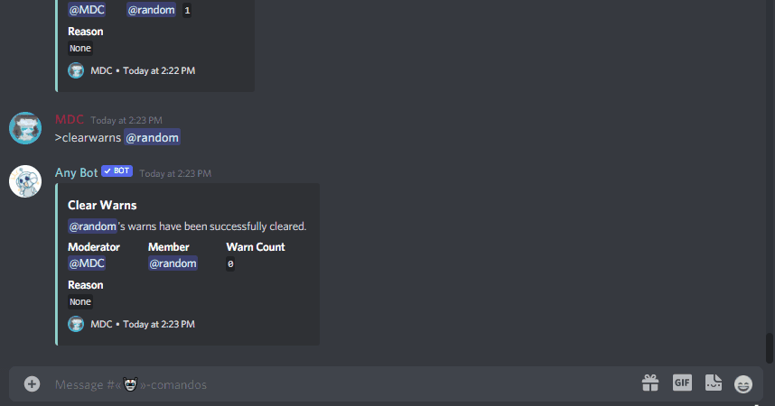

<h1 align="center">Any Bot!</h1>

<p align="center">


</p>


<h2 align="center"><a  href="https://discord.com/api/oauth2/authorize?client_id=733728002910715977&permissions=8&scope=applications.commands%20bot">Demostration</a></h2>

## Description

**NEW WARN SYSTEM**

<p align="center">
</p>


I am [**Any Bot**](https://top.gg/bot/733728002910715977), a multifunctional Discord bot which is a variation of [**Calypso Bot**](https://github.com/sabattle/CalypsoBot), this variation includes backup commands and some extra fun and useful commands that can be useful in any bot.

[](https://top.gg/bot/733728002910715977) 
[](https://top.gg/bot/733728002910715977) 
[](https://top.gg/bot/733728002910715977) 
[](https://top.gg/bot/733728002910715977)

# Features

Currently the Bot has more than 150 commands and 13 categories with which you have a variety of useful and fun commands.

- Categories:
  - **Info [26]**
  - **Fun [29]**
  - **Animals [17]**
  - **Color [5]**
  - **Points [8]**
  - **Misc [3]**
  - **Games [6]**
  - **Mod [17]**
  - **Admin [35]**
  - **Music [1]**
  - **Backup [1]**
  - **Owner [9]**
  - **Nsfw [2]**


## Installation
You can add Any Bot to your server with [this](https://discordapp.com/oauth2/authorize?client_id=733728002910715977&scope=bot&permissions=8)  link! Alternatively, you can clone this repo and host the bot yourself.

```
git clone https://github.com/MDCYT/Any-Bot.git
```

After cloning, run an

```
npm install
```
After installation edit the config.json
```json
{
  "token": "Bot_Token",
  "ownerId": "You_Owner_Id",
  "bugReportChannelId": "bugReportChannelId",
  "feedbackChannelId": "feedbackChannelId",
  "serverLogId": "serverLogId",
  "apiKeys": {
    "catApi": "catApiKey", //https://thecatapi.com/
    "googleApi": "googleApiKey", //https://console.cloud.google.com/
    "fortniteshopApi": "fortniteshopApiKey",//https://fnbr.co/
    "fortniteApi": "fortniteApiKey", //https://fortnitetracker.com/
    "geometrydash": {
      "user": "Geometrydash_User", //Name of the user
      "password": "Geometrydash_Pass" //Password of the user
    },
    "somerandomapikey": "Somerandomapikey", //http://some-random-api.ml/
  },
  "botlist": false
}
```
After editing the config.json, start the bot with `node app` from the terminal
```
node app
```

Optional you can start the bot with `node shards` if you bot is in more than one hundred servers.
```
node shard
```


Make sure you have **PRESENCE INTENT** and **SERVER MEMBERS INTENT** enabled on your bot.
<p align="center">
</p>

## Need help?

You can enter the [Any Bot Support server](https://discord.gg/2FRpkNr)
