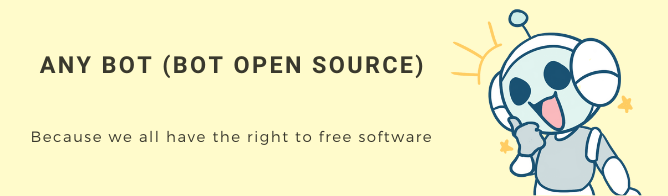
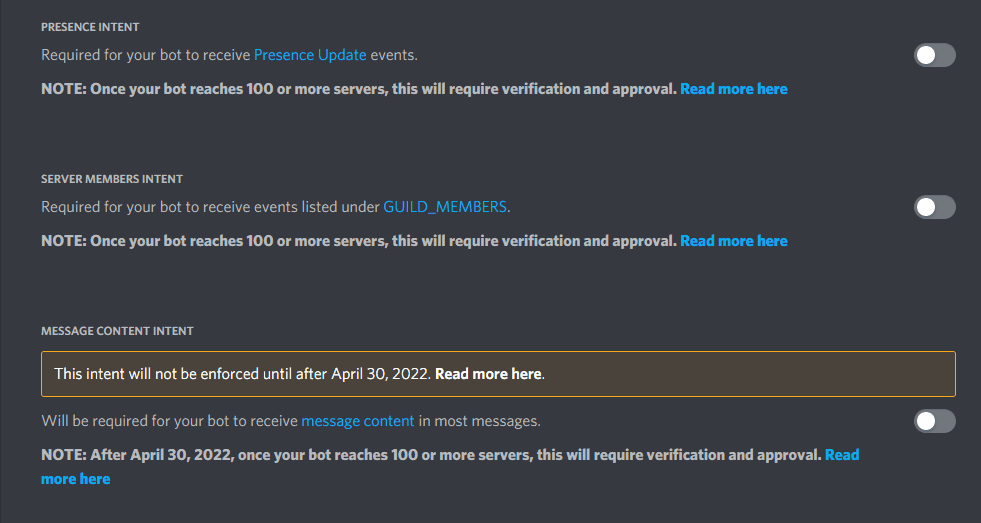

<h1 align="center">Any Bot!</h1>  

<p align="center">  

  

  

  

  

  

  

  

  

  

  

  
</p>  

  

<h2 align="center"><a  href="https://discord.com/api/oauth2/authorize?client_id=733728002910715977&permissions=8&scope=applications.commands%20bot">Demostration</a></h2>

**Content**
- [Description](#Description)
- [Features](#Features)
- [Installation](#Installation)
- [Editing](#Editing)

**NEW ANTIPHISHING SYSTEM**

<p align="center">  
</p>  


## Description


I am [**Any Bot**](https://top.gg/bot/733728002910715977), a multifunctional Discord bot which is a variation of [**Calypso Bot**](https://github.com/sabattle/CalypsoBot), this variation includes backup commands and some extra fun and useful commands that can be useful in any bot.

<p align="center">  

[](https://top.gg/bot/733728002910715977)   
[](https://top.gg/bot/733728002910715977)   
[](https://top.gg/bot/733728002910715977)   
[](https://top.gg/bot/733728002910715977)

</p>  

# Features

The Bot has more than 190 commands and 16 categories with which you have a variety of useful and fun commands.

- Categories:
  - **Info**
  - **Fun**
  - **Utils**
  - **Internet**
  - **Voice**
  - **Animals**
  - **Color**
  - **Points**
  - **Levels**
  - **Misc**
  - **Games**
  - **Social**
  - **Mod**
  - **Admin**
  - **Music**
  - **Backup**
  - **Owner**
  - **Nsfw**


## Installation
You can add Any Bot to your server with [this](https://discordapp.com/oauth2/authorize?client_id=733728002910715977&scope=bot&permissions=8)  link! Alternatively, you can clone this repo and host the bot yourself.

```  
git clone https://github.com/MDCYT/Any-Bot.git  
```  
### Requirements
- [Discord Bot Token](https://discordapp.com/developers/applications/me)
- [Node 16 or higher](https://nodejs.org/en/download/)
- [Python 2.7.2](https://www.python.org/downloads/release/python-272/)
- Pray to god, or, if you're an atheist, cross your fingers.

After cloning, run an

```  
npm install  
```  
After installation edit the ` config-example.json`

```json  
{
  "developers": [  
        "Only if you have developers",
        "Only if you have more of 1 developer" 
  ],
  "botStats":{  
      "guilds_channel": "Your_Guilds_Channel_Stats_Bot"  //A voice channel where the number of servers that use the bot will be displayed (optional)
  },  
  "apiKeys": {  
  "googleApi": "Google_Api_Key",  //Obtain a key in https://console.developers.google.com/ (Only affect the Youtube Command)
  "fortniteshopApi": "Fortnite_Shop_Key", //Obtain a key in https://fnbr.co/api/docs (Only affect the Fortnite Shop command)
  "fortniteApi": "Fortnite_Api_Key",  //Obtain a key in https://fortnitetracker.com/site-api (Only affect the Fortnite User command)
  "geometrydash": {  
      "user": "Username",  //Geometry Dash User
	  "password": "Password"  //Geometry Dash Password
  },  //(Only affect the GD User command)
  "openweathermap": "OpenWatherMap_Api_Key",  //Obtain a key in  https://openweathermap.org/api (Only affect the Weather command)
  "nasaapi": "Nasa_Api_Key",  //Obtain a key in https://api.nasa.gov/ (Only affect the APOD command)
  "uberduckapi_key": "UberDuck_Api_Key",  //Obtain a key in https://uberduck.ai/account/manage (Only affect the IAVoice command)
  "uberduckapi_secret": "UberDuck_Api_Secret",//Obtain a key in https://uberduck.ai/account/manage (Only affect the IAVoice command)  
  "osuapikey": "Osu_Api_Key"  //Obtain a key in https://osu.ppy.sh/p/api (Only affect the IAVoice command)  
  },  
  "botlist": false  //Only active this if your bot is in a Bot list (Edit this in src/utils/botlist.js)
  } 
```  
After editing the `config-example.json` , rename to `config.json`

Now, edit the ` .env-example`

``` dotenv
TOKEN=Your_Bot_Token
BOTID=Your_Bot_ID
OWNERID=Your_Discord_ID
GUILD_ID=Your_Guild_ID
ENV=production #This will define if the slash commands are put or not
MONGODB_URL=Your_MongoDB_URL
APIURL="https://api.any-bot.xyz/api/v1" #You can crate you own API if you want to, check https://github.com/MDCYT/Any-Api
SUPPORTSERVERLINK= "https://discord.gg/efZ8bQYwnN" #This is the link to the support server
SERVERLOGID=Your_Server_Log_Channel_ID #This is the id of the channel where the server logs will be sent
BUGREPORTCHANNELID=Your_Bug_Report_Channel_ID
FEEDBACKCHANNELID=Your_Feedback_Channel_ID
``` 
After editing the `.env-example` , rename to `.env`

start the bot with `node app` from the terminal
```  
node app
```  

Optional you can start the bot with `node shard` if your bot is in more than five hundred servers.
```  
node shard
```  


Make sure you have **PRESENCE INTENT** and **SERVER MEMBERS INTENT** enabled on your bot.
<p align="center">  
</p>  


## Need help?

You can enter the [Any Bot Support server](https://discord.gg/2FRpkNr)
